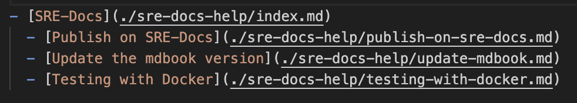

# Publish in SRE-Docs.

#### Format:

* To format your article, you can see this [guide](https://rust-lang.github.io/mdBook/format/index.html) 

#### How to include your article in SRE-Docs?

* If you're adding a new section, make sure to add it to the SUMMARY file, mdbook uses that file to render everything on the browser. <pre>
   .
   ├── book.toml
   ├── book
   ├── VERSION
   ├── Makefile
   ├── src
   │   ├── SUMMARY.md           <<--
   │   ├── intro.md
   │   ├── scope.md
   │   ├── ask.md
   │   ├── sre-process
   │   ├── sre-support
   │   ├── monitoring_cloud
   │   ├── howto
   │   ├── deprecated
   │   └── sre-docs-help
   └── theme
</pre>
   Then you have 9 sections:
   1. [Introduction](../intro.md): (intro.md) for introduction to SRE-Docs
   2. [Scope](../scope.md): (scope.md) What services does SRE provide?
   3. [How to Get Help in #sre-corner](../sre-corner/ask.md): (ask.md)
   4. [SRE Proccess](../sre-process/index.md): (sre-process)
   5. [SRE Support](../sre-support/index.md): (sre-support)
   6. [Monitoring Cloud for SRE (MonC)](../monitoring_cloud/index.md): (monitoring_cloud)
   7. [HowTos](../howto/index.md): (howto) To document troubleshooting of problems made in incidents or related.
   8. [Deprecated](../deprecated/index.md): (deprecated)  To move all articles/sections that are deprecated.
   9. [SRE-Docs](./publish-on-sre-docs.md): (sre-docs-help) To publish articules for help to publish and give format

   Example: Add "[Update the mdbook version](./update-mdbook.md)" and following the tree hierarchy, include the .md file with the relative path **"./sre-docs-help/update-mdbook.md"**

   

   To include a new article in the [SRE-Docs](index.md) section, it is necessary to insert it respecting the order and hierarchy. If the new article must go before an existing one, only this hierarchy must be respected.

   

   _Note_: It is very important to include all .md files in the `.src/SUMMARY.md` as this is the only way for the mdbook to identify it for publishing. For more information about order they should appear, what their hierarchy, see [SUMMARY-Notes](https://rust-lang.github.io/mdBook/format/summary.html)

* Commented sections are not allow at the summary level.
* As everything needs to be on the summary file, it is not possible to reduce the complexity of the index.
* Make sure every reference or link added is pointing to the right place and working as expected.
* You can preview the outcome as explained before. Finally, a PR can be sent to suggest changes.
