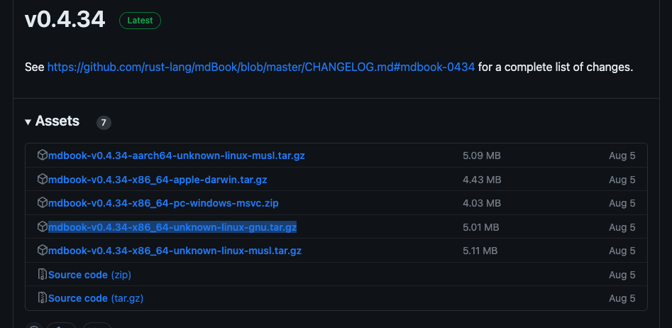
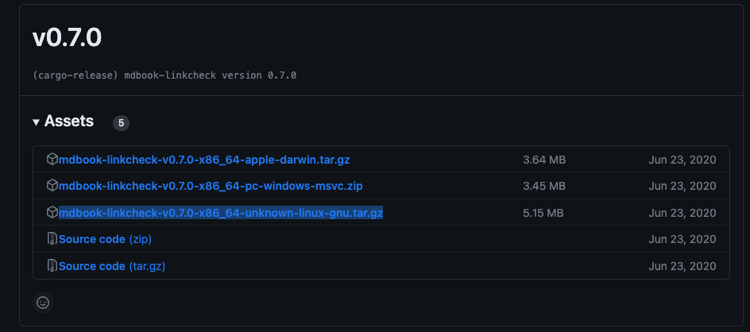
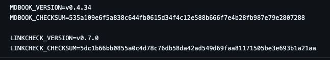

#### Releases Versions:

* In the [SRE-Docs](https://github.com/mulesoft/sre-docs) repositorie, you will see two files, we'll use these files to push the version update to mdbook for SRE-Docs Book:
  - [Makefile](https://github.com/mulesoft/sre-docs/blob/master/Makefile)
  - [VERSION](https://github.com/mulesoft/sre-docs/blob/master/VERSION)

* Makefile, if read this file, in the [download](https://github.com/mulesoft/sre-docs/blob/master/Makefile#L21) seccion, you can see two downloads for two file with the following name format for the file.
  - `mdbook-$(MDBOOK_VERSION)-x86_64-unknown-linux-gnu.tar.gz`
  - `mdbook-linkcheck-$(LINKCHECK_VERSION)-x86_64-unknown-linux-gnu.tar.gz`

* Using the following URLs, identify which release version you need to update the mdbook: We'll use the most stable version possible.

  - mdbook: <https://github.com/rust-lang/mdBook/releases>
  <p align="center"><a href="./img/mdbook.png" target="_blank"></a></p>
  
  - mdbook-linkcheck: <https://github.com/Michael-F-Bryan/mdbook-linkcheck/releases>
  <p align="center"><a href="./img/mdbook-linkcheck.png" target="_blank"></a></p>

  * The next thing is to download each file and give it the hash or  [shasum](https://www.securemac.com/news/how-to-use-checksums-on-mac-to-verify-app-downloads):<br>
     ```sh
     shasum -a 256 mdbook-v0.4.34-x86_64-unknown-linux-gnu.tar.gz
     535a109e6f5a838c644fb0615d34f4c12e588b666f7e4b28fb987e79e2807288 mdbook-v0.4.34-x86_64-unknown-linux-gnu.tar.gz
     shasum -a 256 mdbook-linkcheck-v0.7.0-x86_64-unknown-linux-gnu.tar.gz
     5dc1b66bb0855a0c4d78c76db58da42ad549d69faa81171505be3e693b1a21aa  mdbook-linkcheck-v0.7.0-x86_64-unknown-linux-gnu.tar.gz
     ```
     <br>
     We take this result and put it in the [VERSION](https://github.com/mulesoft/sre-docs/blob/master/VERSION)
     <p align="center"><a href="./img/version.png" target="_blank"></a></p>


